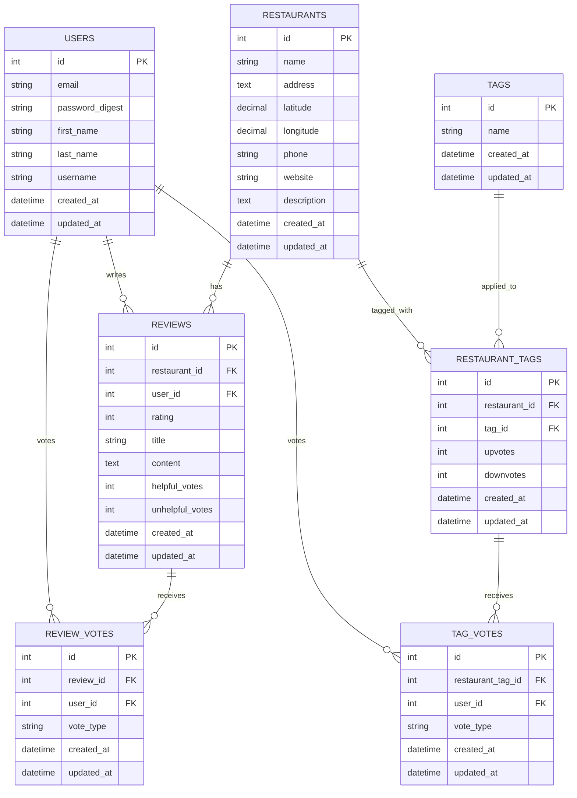

# Restaurant Reviews Rails App

A Ruby on Rails application for restaurant reviews with Google Maps integration, tagging system, and community voting.

## Table of Contents

- [Features](#features)
- [Database Schema](#database-schema)
- [Models](#models)
- [Installation](#installation)
- [Usage](#usage)
- [API Endpoints](#api-endpoints)

## Features

- **Restaurant Management**: Add and manage restaurant information with location data
- **Review System**: 1-5 star rating system with detailed reviews
- **Tagging System**: Community-driven tags with voting mechanism
- **Search Functionality**: Search restaurants by name, tags, and reviews
- **Google Maps Integration**: Location-based restaurant discovery
- **Voting System**: Vote on tags and reviews for quality control
- **User Authentication**: Secure user accounts with bcrypt

## Database Schema



## Models

### User

- Handles authentication with `has_secure_password`
- Can write multiple reviews
- Can vote on tags and reviews
- Unique email and username validation

### Restaurant

- Core entity with location data (latitude/longitude)
- Has many reviews and tags through restaurant_tags
- Includes distance-based search scope
- Calculates average rating and review count

### Review

- Belongs to restaurant and user
- 1-5 star rating system
- Users can only review each restaurant once
- Tracks helpful/unhelpful votes

### Tag

- Simple name-based tagging system
- Case-insensitive with normalization
- Connected to restaurants through restaurant_tags

### RestaurantTag

- Join table between restaurants and tags
- Tracks upvotes and downvotes
- Auto-removes tags with poor vote ratios (>3:1 down:up with 5+ votes)

### TagVote & ReviewVote

- Track individual user votes
- Prevent duplicate voting
- Automatically update parent vote counts

## Installation

1. Clone the repository
2. Install dependencies:
   ```bash
   bundle install
   npm install
   bundle exec rails db:setup
   foreman start
   ```
3. Create and migrate the database:
   ```bash
   rails db:create
   rails db:migrate
   rails db:seed
   ```
4. Start the server:
   ```bash
   rails server
   ```

## Usage

### Creating a Restaurant

```ruby
restaurant = Restaurant.create!(
  name: "Joe's Pizza",
  address: "123 Main St, New York, NY",
  latitude: 40.7128,
  longitude: -74.0060,
  phone: "(555) 123-4567",
  description: "Best pizza in town!"
)
```

### Adding a Review

```ruby
review = Review.create!(
  restaurant: restaurant,
  user: user,
  rating: 5,
  title: "Amazing pizza!",
  content: "The crust was perfect and the sauce was delicious."
)
```

### Tagging a Restaurant

```ruby
tag = Tag.find_or_create_by_name("Italian")
restaurant_tag = RestaurantTag.create!(restaurant: restaurant, tag: tag)
```

### Voting on Tags

```ruby
TagVote.create!(
  restaurant_tag: restaurant_tag,
  user: user,
  vote_type: 'up'
)
```

## API Endpoints

The application will support the following key endpoints:

- `GET /restaurants` - List restaurants with search/filter options
- `GET /restaurants/:id` - Show restaurant details with reviews and tags
- `POST /restaurants` - Create new restaurant
- `POST /restaurants/:id/reviews` - Add review to restaurant
- `POST /restaurants/:id/tags` - Add tag to restaurant
- `POST /tag_votes` - Vote on restaurant tags
- `POST /review_votes` - Vote on reviews
- `GET /search` - Global search across restaurants, tags, and reviews

## Database Features

- **Geospatial Queries**: Find restaurants within a specified distance
- **Vote Aggregation**: Automatic vote counting with callbacks
- **Data Integrity**: Foreign key constraints and unique indexes
- **Performance**: Strategic indexing on search and lookup fields
- **Auto-cleanup**: Automatic removal of poorly-rated tags
